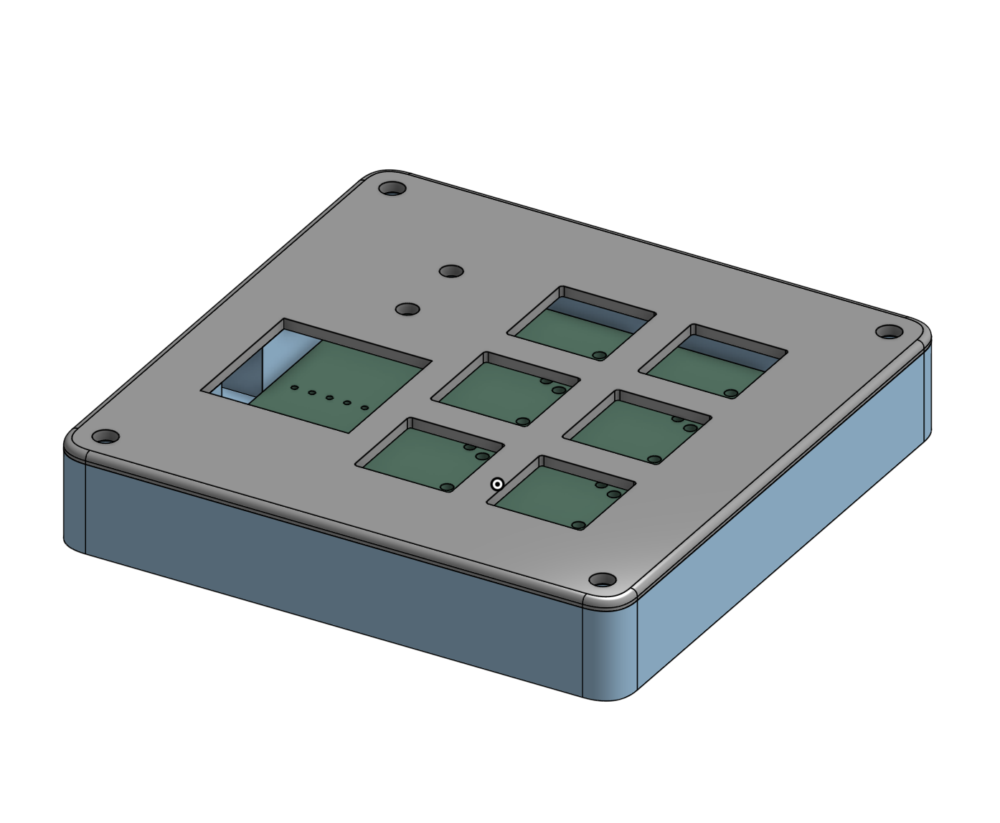
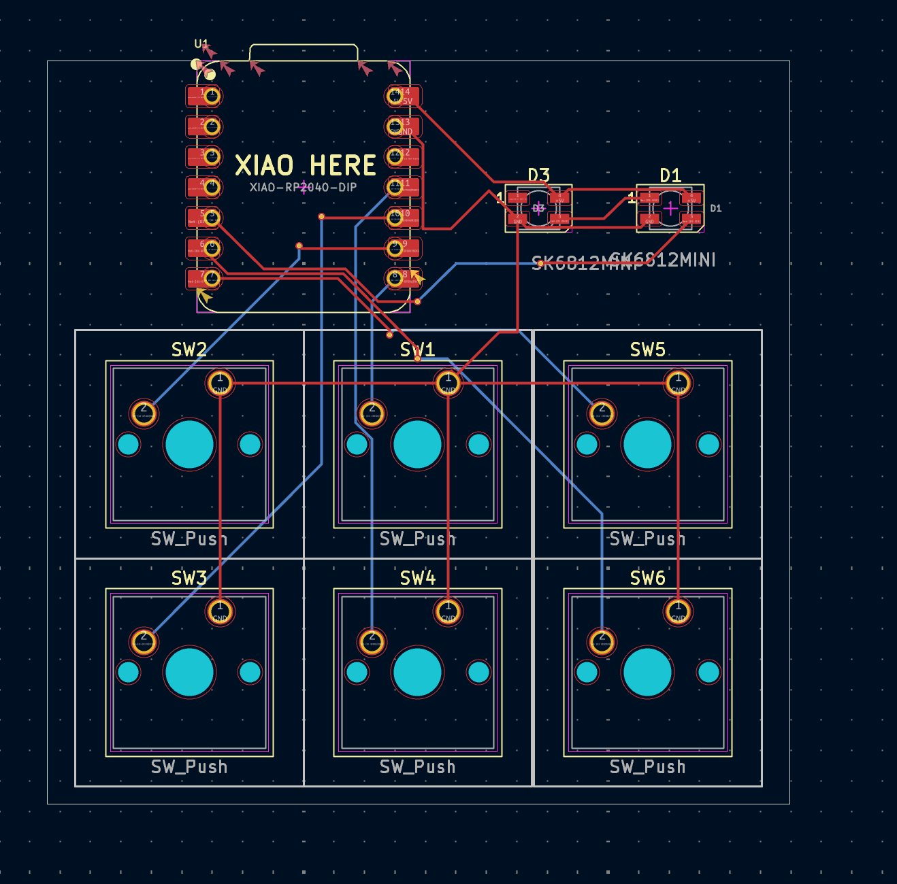
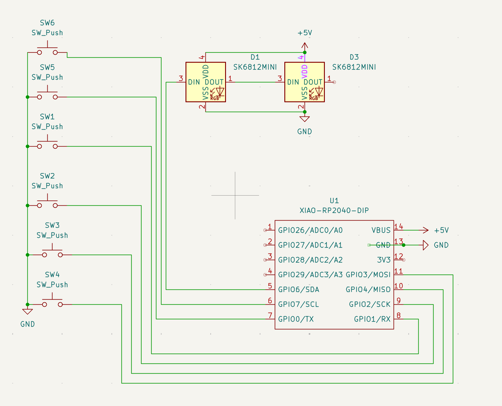

# hackpad

## Overview

## PCB Layout

## Schematic

# Bill of Materials (BOM)
## Components List

| Reference | Quantity | Description | Package/Type | Notes |
|-----------|----------|-------------|--------------|-------|
| U1 | 1 | XIAO-RP2040-DIP | DIP-14 | Seeed Studio XIAO RP2040 in DIP format |
| SW1-SW6 | 6 | Tactile Push Button Switch | Through-hole | Momentary, normally open |
| D1, D3 | 2 | SK6812MINI RGB LED | 3535 SMD | Addressable RGB LEDs |
| x | 1 | 3d Printed Case | x | Will be printed on my personal printer |
